<div align="center">

**English** · [فارسی](README.fa.md)


<br>

**Pick a flavor, a store and a device from a menu. Read `flutter run` as clean,
colored logs you can click, with every network call on one line.**

<br>


[](https://github.com/NaderMozaffari/fdev/releases)


[Install](#install) •
[Use](#use) •
[Launcher](#the-launcher) •
[Log viewer](#the-log-viewer) •
[Keys](#keys-in-the-log-viewer) •
[Themes](#the-look-and-saving-logs) •
[Wi-Fi](#wi-fi-debugging) •
[`fdev_log`](#structured-logs-in-your-app)

<br>


</div>

> [!NOTE]
> fdev is in **beta**: it's used every day, but expect rough edges, and
> changes before `v1.0.0`. Its versions say so (`v0.2.0-beta.1`), and
> [stable releases](#versions-beta-and-stable) will come apart from them.
> Something wrong? [Open an issue](https://github.com/NaderMozaffari/fdev/issues).

<br>

Built with Charm's [Bubble Tea](https://github.com/charmbracelet/bubbletea),
[Bubbles](https://github.com/charmbracelet/bubbles) (list, viewport, help,
spinner), [Huh](https://github.com/charmbracelet/huh) and
[Lip Gloss](https://github.com/charmbracelet/lipgloss), in Charm's palette;
log lines look like [Log](https://github.com/charmbracelet/log)'s.

## At a glance

<table>
<tr>
<td width="50%" valign="top">

**Pick, don't type.** Recent runs first, then Run, Build, Tools and Saved
logs; then the platform and the flavor, each with its icon.

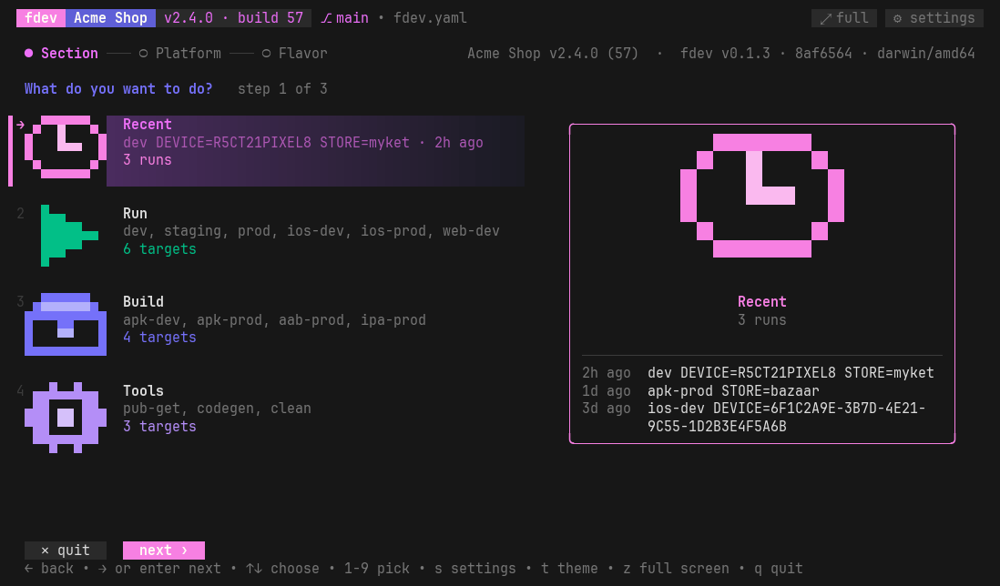

</td>
<td width="50%" valign="top">

**Know what you start.** The target under the cursor, with its app icon:
its flavor's facts, what it runs and asks, when it last ran.

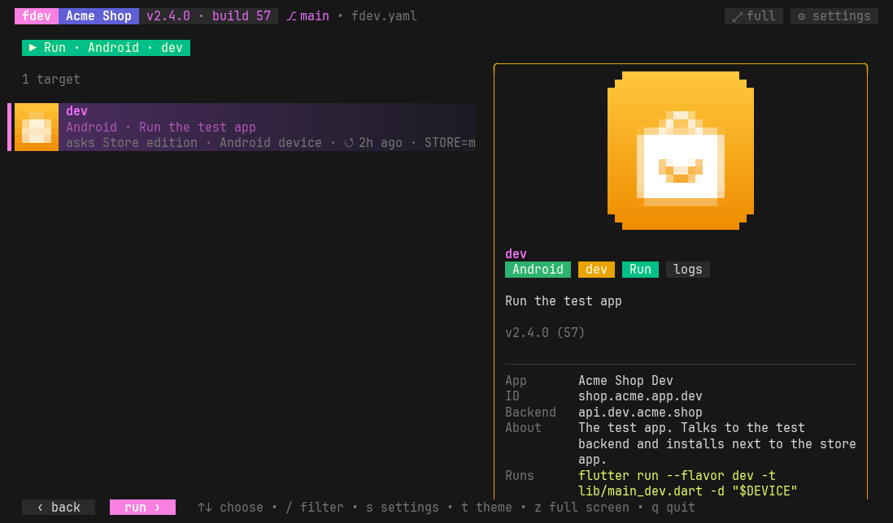

</td>
</tr>
<tr>
<td valign="top">

**Questions with answers to pick.** Store editions, devices: last time's
answer is preselected.

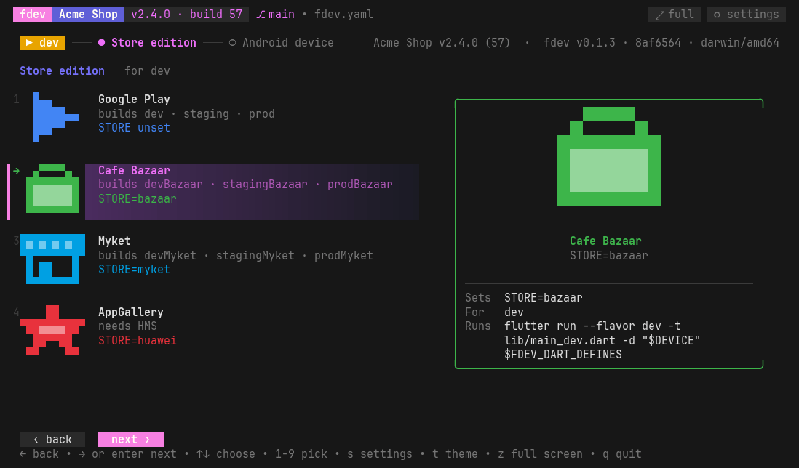

</td>
<td valign="top">

**Builds you can watch.** A progress bar measured against how long the same
step took last time.

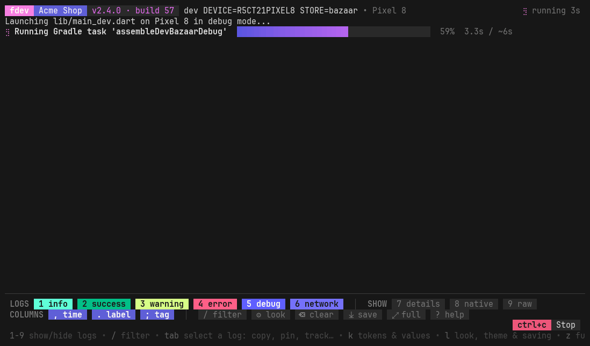

</td>
</tr>
<tr>
<td valign="top">

**Network calls on one line**, that open to their headers and body. A request
still waiting spins.

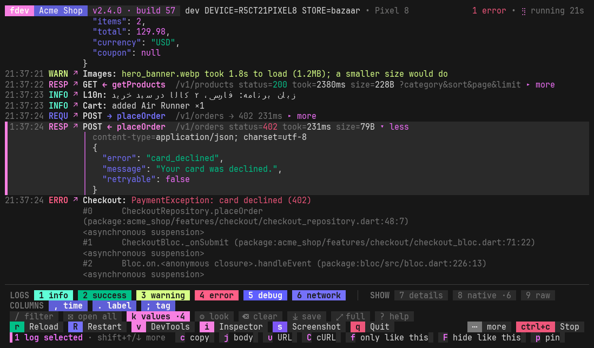

</td>
<td valign="top">

**Filter like a search.** `tag:Auth`, `status:4`, `method:post`, `-word`
and more.

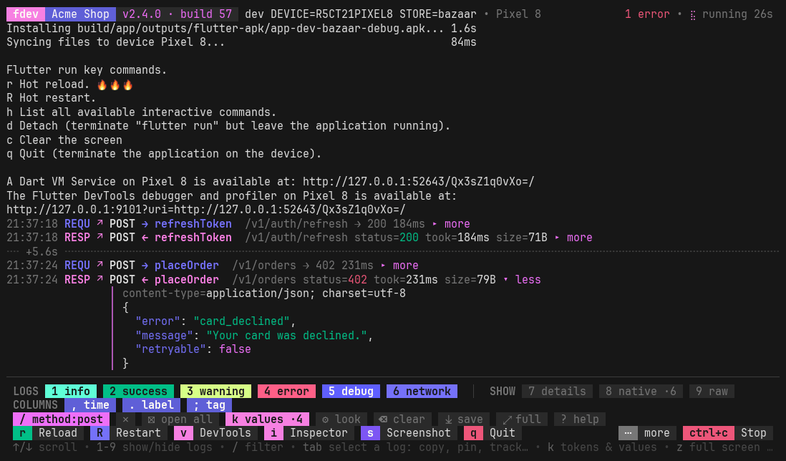

</td>
</tr>
<tr>
<td valign="top">

**Select logs** to copy, copy as cURL, filter, pin, bookmark, track, hide
or save.

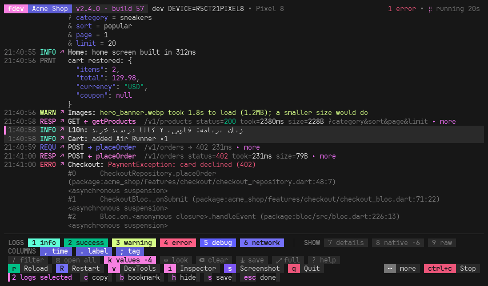

</td>
<td valign="top">

**Tokens at hand.** The newest access token, user id and other values, to
copy any time.

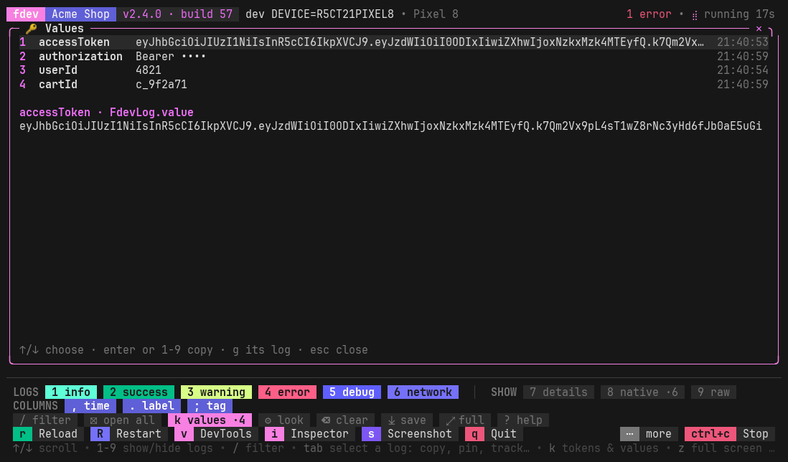

</td>
</tr>
</table>

<div align="center">

**Ten themes, three layouts**: Charm, Dracula, Tokyo Night, Catppuccin Latte, Gruvbox, Nord, …

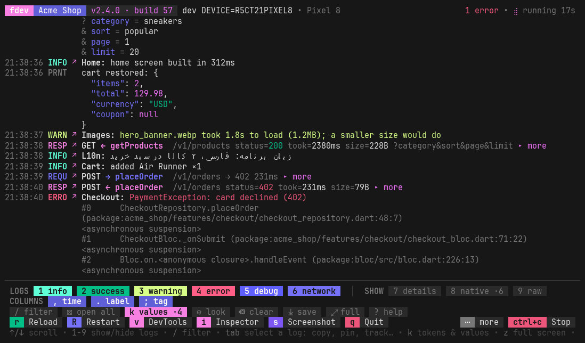

</div>

## Install

One line, with nothing else to install first: the script picks the build
for your OS and CPU, checks it against the release's checksums and puts
`fdev` on your PATH. Run it again to update, or run `fdev update`.

**macOS / Linux** (in Terminal):

```sh
curl -fsSL https://raw.githubusercontent.com/NaderMozaffari/fdev/main/scripts/install.sh | sh
```

<sub>No curl? `wget -qO- https://raw.githubusercontent.com/NaderMozaffari/fdev/main/scripts/install.sh | sh`</sub>

**Windows, PowerShell** (the prompt starts with `PS`):

```powershell
irm https://raw.githubusercontent.com/NaderMozaffari/fdev/main/scripts/install.ps1 | iex
```

**Windows, Command Prompt** (`cmd`, the prompt is just `C:\>`):

```bat
powershell -ExecutionPolicy Bypass -c "irm https://raw.githubusercontent.com/NaderMozaffari/fdev/main/scripts/install.ps1 | iex"
```

> [!TIP]
> `'sh' is not recognized` or `'irm' is not recognized` means the command
> is for another shell: in `cmd`, use the Command Prompt line above.

The scripts install to `%LOCALAPPDATA%\Programs\fdev` on Windows and
`~/.fdev/bin` elsewhere (`FDEV_INSTALL_DIR` to change it), and put it on
your PATH: the user PATH on Windows, and the startup file of each shell you
have (zsh, bash, fish, sh) elsewhere. Open a new terminal, then run `fdev`.

<details>
<summary><b>A beta, or a particular version</b></summary>

While there is no stable release, the scripts install the newest beta, and
say so. To get betas from then on too:

```sh
curl -fsSL https://raw.githubusercontent.com/NaderMozaffari/fdev/main/scripts/install.sh | sh -s -- --beta
```

```powershell
$env:FDEV_CHANNEL = 'beta'; irm https://raw.githubusercontent.com/NaderMozaffari/fdev/main/scripts/install.ps1 | iex
```

A version: `sh -s -- v0.2.0-beta.1`, or `$env:FDEV_VERSION = 'v0.2.0-beta.1'`
in PowerShell. From `cmd`, put the PowerShell line in quotes after
`powershell -c`.

</details>

<details>
<summary><b>By hand</b>, without a script</summary>

From the [releases](https://github.com/NaderMozaffari/fdev/releases),
download the archive for your computer:

| | |
|---|---|
| macOS, Apple silicon (M1 and later) | `fdev_darwin_arm64.tar.gz` |
| macOS, Intel | `fdev_darwin_amd64.tar.gz` |
| Linux | `fdev_linux_amd64.tar.gz`, or `fdev_linux_arm64.tar.gz` on ARM |
| Windows | `fdev_windows_amd64.zip`, or `fdev_windows_arm64.zip` on ARM |

Check it against `checksums.txt` (`shasum -a 256 <file>`, or
`Get-FileHash <file>` on Windows), unpack it, and put `fdev` (`fdev.exe`)
in a folder on your PATH. On macOS, a file downloaded with a browser needs
`xattr -d com.apple.quarantine fdev` before it runs; on Windows, SmartScreen
may ask before the first run (**More info → Run anyway**).

If `raw.githubusercontent.com` can't be reached, every release carries the
install scripts too: download `install.sh` or `install.ps1` from it and run
it (`sh install.sh`, or `powershell -ExecutionPolicy Bypass -File install.ps1`).

</details>

<details>
<summary><b>With Go</b> (1.27.1 or newer, or Go downloads it)</summary>

```sh
go install github.com/NaderMozaffari/fdev@latest
```

`@v0.2.0-beta.1` for a version. Go puts it in `$(go env GOPATH)/bin`.

</details>

<details>
<summary><b>On Windows</b>: what's different</summary>

The log viewer runs commands without a pty, through Git for Windows' `sh`
(Flutter needs Git for Windows anyway), or `cmd` if there is no `sh`. Some
tools print without colors because of this, and **Stop** (`ctrl+c`) ends
the command. Makefile targets need `make` on the PATH
(`winget install ezwinports.make`).

</details>

### Versions: beta and stable

fdev's versions are [semantic versions](https://semver.org). A version
with a pre-release part, like `v0.2.0-beta.1`, is a **beta**: published as
a GitHub pre-release, marked as one by `fdev version` (`fdev v0.2.0-beta.1
(beta)`) and on its About page. A version without one, like `v1.0.0`, is
**stable**. fdev is in beta until `v1.0.0`.

```sh
fdev update             # the newest of its channel: a beta updates to the newest beta
fdev update --stable    # stable releases only
fdev update --beta      # betas too
fdev update v0.1.3      # that version, to go back to it too

fdev channel            # which channel this fdev is on
fdev channel stable     # switch: install the newest stable release, even from a newer beta
fdev channel beta       # switch: install the newest beta
```

After a switch, `fdev update` keeps to that channel, because it follows
the fdev that's installed. `FDEV_CHANNEL=beta` (or `stable`) sets the
channel for good, whatever is installed.

<details>
<summary><b>Uninstall</b></summary>

Delete `~/.fdev` (and the `# fdev` lines the script added to `~/.zshrc`,
`~/.bashrc`, `~/.bash_profile`, `~/.profile` or
`~/.config/fish/conf.d/fdev.fish`); on Windows, delete
`%LOCALAPPDATA%\Programs\fdev` and take it out of your user PATH. fdev's
settings are in your user cache, in a folder named `fdev`.

</details>

To help with fdev (run it from source, open a pull request, or make a release), see [CONTRIBUTING.md](CONTRIBUTING.md).

## Use

Run `fdev` anywhere inside a project. It finds the project root by looking
up for `fdev.yaml`, then a `Makefile` or `pubspec.yaml`.

```sh
fdev                     # the menu
fdev dev                 # start the `dev` target straight away
fdev logs -- flutter run -d emulator-5554 --dart-define=FDEV_LOGS=true
fdev wifi                # debug an Android phone over Wi-Fi (also Tools → wifi-debug)
fdev help                # every command, and this project's targets
fdev help update         # one command's options
```

A mistyped command, option or target stops with the closest ones
(`fdev versoin` → *Did you mean? fdev version*).

> [!TIP]
> Nothing to set up, and nothing in git: at every start fdev works the menu
> out of the project itself, so it never goes stale.

- **Targets** are the Makefile's rules, described by their `make help` line
  (`@echo "  dev    Run the test app"`), a `## text` after the rule or a
  `# text` line above it. fdev expands each recipe the way make would and
  reads the group (`flutter run` is Run, `flutter build` is Build, the rest
  Tools), the flavor (`--flavor`, `-t lib/main_<flavor>.dart`), the
  platform (`-d chrome`, `build apk`, variables named `ANDROID_…`/`IOS_…`,
  `ios/` in a tool's recipe) and the questions: `DEVICE ?=` asks for a
  device, and any other empty `NAME ?=` the recipe uses asks for one of the
  values the Makefile tests it against (`$(filter myket,$(STORE))`), with
  the usual stores' names and icons (Google Play, Cafe Bazaar, Myket,
  AppGallery, ...).
- **Flavors** come from `android/app/build.gradle(.kts)` (`productFlavors`;
  `devMyket` is the Myket edition of `dev`), their labels in `strings.xml`,
  `ios/Runner.xcodeproj` (bundle ids, display names) and a Dart enum in
  `lib/` with a value per flavor, like `dev(apiHost: 'test.example.com')`:
  its strings (a host or URL is the Backend) and doc comment.
- Without a Makefile: `flutter run` per flavor, builds, `pub get`, `test`, ...

What it found is written to `.fdev/fdev.yaml` to look at (fdev never reads
it back); `.fdev/` holds a `.gitignore` of `*`, so git sees none of it.

To take over, put an `fdev.yaml` in the project root (start from
`.fdev/fdev.yaml`, or see [fdev.example.yaml](fdev.example.yaml)): fdev
then uses it as it is.

## The launcher

At start fdev asks, a step at a time, the **section** (Recent first, then
Run, Build, Tools, Saved logs), then the **platform** and the **flavor**
among its targets, each answer with its icon (fdev's own pixel icons, and
the app's icon for a flavor, drawn with half blocks so any color terminal
shows them) and a card with what it holds.

- Last time's answers are preselected; `→` or `enter` goes on, `←` or `esc`
  goes back, `1`-`9` picks, and so do the buttons at the bottom; steps with
  one answer are skipped.
- Then pick a target (from `fdev.yaml`, your Makefile, or plain `flutter`
  commands), answer its questions (store edition, device, ...) the same
  way, with icons (an option's `icon` and `color` in `fdev.yaml`) and `←`
  back to the one before, and run it.
- A panel shows the target under the cursor with its app icon, big: its
  flavor's facts, what it runs and asks, when it last ran. A target without
  a platform or flavor shows under every one.
- Hover to select, click to run. fdev's own settings are behind
  **⚙ settings** (or `s`; `t` for the theme), and **⤢ full** (or `z`)
  hides the keys and buttons.

The terminal's tab is named after what runs in it, with a circle in the
flavor's color: `🟡 fdev v1.4.0 • Acme Shop • dev • SM-S918B • bazaar`,
and `✓` or `✘` once it ends. VS Code (and Cursor) name tabs after the
process unless `terminal.integrated.tabs.title` has `${sequence}`, so fdev
adds that to your user settings the first time it runs in their terminal;
a value you set yourself is left alone. They have no way for a program to
change a tab's icon or color, so the circle stands in for both.

## The log viewer

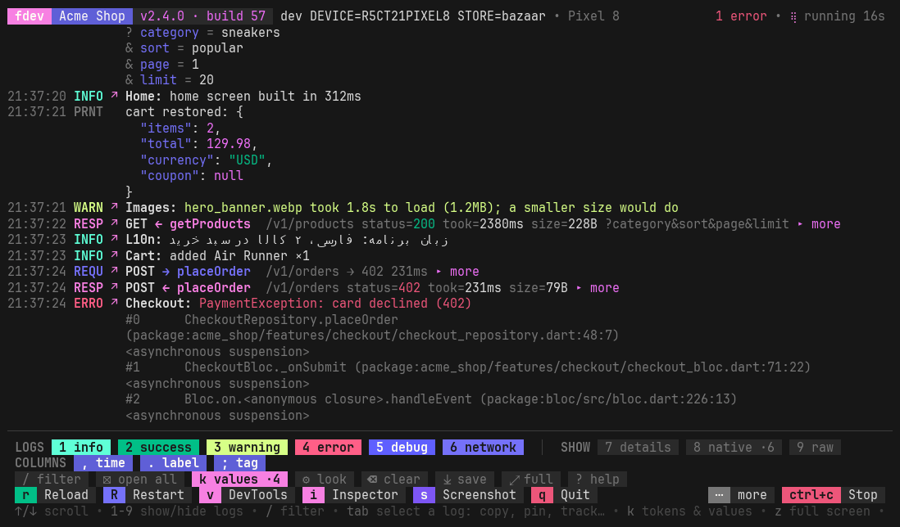

`flutter run` without the `I/flutter (12345):` noise. Each log is one line
with its time, level and tag, and `↗` opens the line of code that logged it.

- **Network calls** are one line (`RESP GET /v1/me status=200 took=142ms`)
  that expands to headers and body. A URL's query parameters are shown
  apart, one a line (`? type = UPDATE_INFORMATION`), not glued to the path.
- A request still waiting for its response **spins**, with the time so far;
  once the response comes, the request says what it got (`→ 200 142ms`),
  and the header counts the calls in flight.
- Toggle **categories** while the app runs (`1`-`9`), and **filter** by
  text.
- Under the logs, the running command's keys are **buttons**, each with its
  key beside it: flutter's (`r` Reload, `R` Restart, `v` DevTools, `i`
  Inspector, `s` Screenshot, `q` Quit, and the rest behind **more**), or,
  for other tools, the keys they print (`press r + enter to restart`,
  `› Press a │ open Android`, or a list after a "key commands" line); then
  **Stop** (`ctrl+c`) while it runs and **Back** (`enter`) after.
- While flutter works on a step (`Running Gradle task 'assembleDevDebug'...`,
  `Installing ...apk...`), a **progress bar** shows how far along it is,
  measured against how long the same step took last time; the first time,
  with nothing to measure against, it is a loading bar that sweeps instead
  of filling. Terminals that support it show the progress on their tab too.
- **Builds and other commands** run in the same viewer, so their output
  stays scrollable and filterable, with errors in red.

### Keys in the log viewer

| Key | |
|---|---|
| `1`-`9` | info, success, warning, error, debug, network, network details, native Android logs, raw output |
| `,` `.` `;` | show or hide the time, the level label and the tag |
| `/` | filter: words a log must all have; `tag:Billing`, `level:error`, `url:/v1/me`, `status:4`, `method:post`, `name:getProfile`, `is:bookmarked`, `is:pinned`, `is:tracked`, `is:hidden`, `is:waiting`, `"two words"`, and `-` before a word to leave those out; `esc` clears it |
| `?` | all the keys |
| `k`, **k values** | tokens and other values, the newest of each, to see and copy any time: see below |
| `l` | layout, labels, spacing, group lines, time, saving, turned-off shortcuts |
| `ctrl+s` | save the whole log to `.fdev/logs` |
| **⤓ save** | save some logs, with a subject and tags: the selected ones, the ones shown, the bookmarked ones or all, as text (opens in fdev again), Markdown or JSON |
| `ctrl+l`, **⌫ clear** | clear the screen, not the log: what came before is saved (saving starts if it was off) and the session's file goes on after a `──── cleared ────` line; flutter's `c` does the same |
| `↑` `↓` `pgup` `pgdn` `home` `end`, mouse wheel | scroll, smoothly (the wheel speeds up as it keeps turning); `end` follows new output again |
| click `↗` | open the code that logged the line |
| click a line with `▸` | expand its headers and body, or the whole stack trace: they unfold, marked for a moment |
| `x`, **⊞ open all** | open every network call (and the ones that come after); again to fold them |
| `e`, click **… more lines · ⤢ open** | a long log (a big response body, a long print) shows its first rows; this opens all of it in a window: `↑` `↓` `pgup` `pgdn` `home` `end` scroll, `c` copies the body, `esc` closes |
| `tab`, click a log | select it; `↑` `↓` move, `shift+↑` `shift+↓` (or shift+click) select a range. The bar at the bottom is then what you can do with them: `c` copy, `j` copy the body, `u` copy the URL, `C` copy the call as cURL, `f` only logs like it, `F` hide logs like it, `p` pin it to the top, `b` bookmark, `t` track it, `s` save, `o` open in a window, `g` open its code; `esc` is done |
| `[` `]` | the bookmark before or after |
| `m` | mouse on/off; off (or holding ⌥/shift) lets you select text |
| `z`, **⤢ full** | full screen: just the title and the logs; `z`, `esc` or **⤡ exit** in the corner bring the bars back |
| `h` (with logs selected) | hide them: each leaves an empty row with **◌ show**, which brings it back, so the logs around stay put |
| anything else | goes to flutter: `r` reload, `R` restart, `q` quit, ... |

The digits only become toggles once flutter lists its key commands, so a
flutter prompt ("choose a device: 1, 2, ...") still gets them. The toggles
are remembered per project.

A **pinned** log stays at the top of the logs however far they scroll. A
**tracked** log stays there too, as the newest of the logs like it (the
same call, or the same message whatever its numbers), with how many came:
`◉ 12:04:51 RESP GET ← getProfile /v1/me 200 142ms ×7`. A click on the
row shows the log; its `✕` unpins it or stops tracking.

### Values at hand

`k` opens the values kept from the logs: the newest of each name, to see in
full and copy (`enter`, or `1`-`9`), and `g` shows the log it came in.
They are kept for the session only, and come from

- tokens in network headers and bodies: `authorization`, `access_token`,
  `refresh_token`, `id_token`, `token`, `jwt`, `session_id`, `api_key`,
  ... (when the app doesn't mask them; `fdev_log` does, by default);
- what the app hands over: `FdevLog.value('accessToken', token)`, which
  isn't masked;
- the keys you name in `fdev.yaml`: `logs: {values: [userId, deviceId]}`.

### The look, and saving logs

<table>
<tr>
<td width="50%" valign="top">
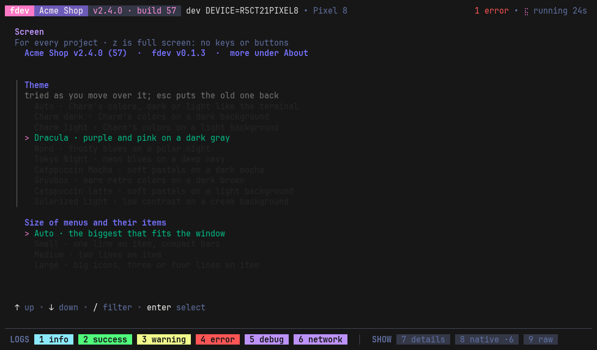
</td>
<td width="50%" valign="top">
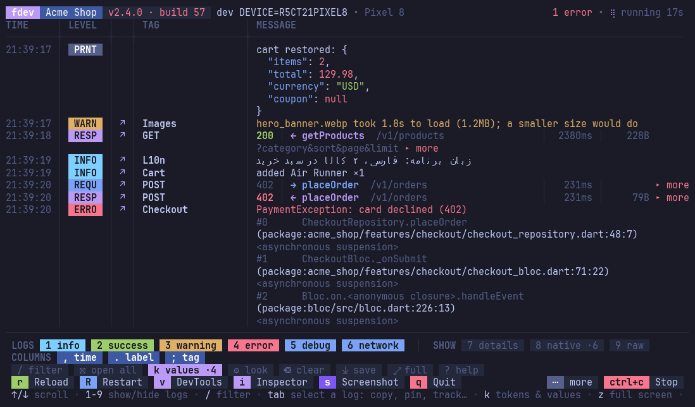
</td>
</tr>
</table>

`l` in the viewer (or **⚙ settings** / `s` in the menu, `t` for the theme)
opens the settings. First the screen, for every project:

- **Theme**: *Auto* (Charm's colors, dark or light like the terminal), or
  Charm dark or light, Dracula, Nord, Tokyo Night, Catppuccin (Mocha and
  Latte), Gruvbox or Solarized Light, which paint the terminal's
  background while fdev runs (where the terminal lets them). Each one is
  tried as the cursor moves over it; `esc` puts the old one back.
- **Size of menus and their items**: *Auto* takes the biggest that fits
  the window; *Small* is one line an item, no blank lines, and compact
  bars in the viewer (no section titles, one row of the command's
  buttons), for small screens; *Medium* two lines; *Large* the big icons.

Full screen (`z`, or **⤢ full** at the top of the menus and in the
viewer's bar) hides the keys, the hints and the buttons: in the viewer,
only the title stays above the logs. It is off at every start.

Then the logs, for this project:

- **Layout**: *lines* (compact, like charmbracelet/log), *columns* (a tag
  column; network lines as `METHOD STATUS URL TOOK SIZE` columns) or *table*
  (the columns with borders and a header).
- **Labels**: colored text, or badges with a background.
- **Space** between logs, and the **time** with or without milliseconds.
- **Line between related logs**: a dashed `╌╌ +2.4s ╌╌` line after a pause
  of a second or more, so each burst (what one tap logs) is a group, and a
  response stays with its request however long it took; or a line where
  the tag changes (`╌╌ AuthRepo ╌╌`); or none.
- **Persian and Arabic text**: most terminals (VS Code's, iTerm2, Ghostty,
  kitty, Windows Terminal) draw it unjoined and left to right; fdev joins
  the letters and lays it out right to left (numbers in it stay left to
  right). *Auto* leaves it to the terminals that do it themselves
  (Terminal.app, GNOME Terminal and others on VTE, Konsole). Only the
  screen changes: saved logs and copies keep the text as it was. The
  filter matches Persian and Arabic letters of one sound (`ي` `ی`, `ك`
  `ک`), with or without a half-space, and Persian digits as 0-9.
- **Save every session.**
- **Turned-off shortcuts**: `ctrl+c`, `ctrl+l`, `ctrl+s`, `ctrl+d`, `ctrl+z`
  picked here do nothing when pressed (the viewer says so); the Stop and
  clear buttons still work.

`ctrl+s` saves the whole log any time: every line, whatever is hidden, with
stack traces, headers and bodies. Logs go to `.fdev/logs/` in the project
(`<time>_<target>.log`, and `.raw.log` with the original output while
recording, each line after the time it arrived); fdev puts a `.gitignore`
of `*` in that directory, so git sees nothing there and no tracked file
changes. The last 30 sessions are kept, and every starred one.

**⤓ save** (or `s` with logs selected) saves some of them, with a
**subject** and **tags**: the selected logs, the ones shown (filters
applied), the bookmarked ones, or all; as text, which opens in fdev again
and shows in Saved logs under its subject and tags (starred, so it is never
cleaned up), as Markdown for an issue, or as JSON.

**Saved logs** in the menu lists them, starred first: `→` opens one in the
viewer as it was (toggles, filter, expanding and `↗` work), `space` stars
it, `x` twice deletes it, `o` opens the file in your editor.

Your settings are kept per project in your user cache; `logs:` in an
`fdev.yaml` sets the defaults for everyone.

### Opening code

fdev runs the editor itself, with the file and line as arguments (no shell,
no URL handler), and only for files that exist inside the project. It
uses VS Code or Cursor when it runs in their terminal, Android Studio or
IntelliJ in theirs, then `code`, then `$VISUAL` / `$EDITOR`. To choose:

```sh
export FDEV_EDITOR='zed {file}:{line}:{col}'      # or put `editor:` in fdev.yaml
```

## Wi-Fi debugging

`fdev wifi` (or **wifi-debug** under Tools, in a project with an Android
app) gets a phone on adb over Wi-Fi. It first connects the phones paired
before that announce themselves. Otherwise it shows a QR code in the terminal
for the phone's **Wireless debugging → Pair device with QR code**. Choose
**Pair device with pairing code** instead and fdev finds the phone and asks
for the 6 digits; if your network hides the phone, type the IP address &
port the dialog shows. `fdev wifi pair` goes straight to pairing.

When the phone can't be reached, it says why instead of adb's `protocol
fault`:

- **a VPN**: the phone's traffic goes into the tunnel (`utun4`) instead of
  the Wi-Fi. fdev names the VPN apps running and how to let the local
  network past each, or prints the `sudo route` line that sends just the
  phone around the VPN;
- **another network**: the phone and computer are on different Wi-Fis;
- **a closed port or no answer**: the dialog closed, the screen locked, or
  the Wi-Fi keeps devices apart (guest networks, AP isolation).

## Structured logs in your app

The viewer works with any app: it strips the logcat prefixes, colors by
level, and understands one-line logs like `INFO [Tag] message`. For the
full experience (tags, multi-line JSON, network lines, `↗` links) print
logs in fdev's [record format](docs/PROTOCOL.md). The
[`fdev_log`](dart/fdev_log) package does that:

```yaml
dependencies:
  fdev_log:
    git: {url: https://github.com/NaderMozaffari/fdev, path: dart/fdev_log}
```

```dart
import 'package:fdev_log/fdev_log.dart';

void main() {
  FdevLog.appPackage = 'my_app';        // its frames are what ↗ links to
  FdevLog.skip = ['core/logger/'];      // your own logging helpers, if any
  FdevLog.info('connected', tag: 'Billing');
  runApp(const App());
}
```

Maps and lists show as indented JSON, in a record or a plain `print`:
`FdevLog.info(user)` (a `Map`, or a model with `toJson()`), and also what
Dart prints for a map, `print('state: $map')` → `state: {id: 7, tags: [a,
b]}`, which fdev reads back into JSON.

`FdevLog.value(name, value)` keeps a value at hand in the viewer (`k`).

It prints records only when the app is built with
`--dart-define=FDEV_LOGS=true`; fdev puts that in `FDEV_DART_DEFINES` for
`logs: true` targets, so pass it on in your Makefile:

```make
RUN_ARGS ?= $(FDEV_DART_DEFINES)

dev:
	flutter run --flavor dev $(RUN_ARGS)
```

Otherwise logs are plain one-line text, and in release builds nothing.

<details>
<summary><b>A Dio interceptor</b></summary>

```dart
class FdevDioLogger extends Interceptor {
  static const _start = 'fdev_start';

  @override
  void onRequest(RequestOptions options, RequestInterceptorHandler handler) {
    options.extra[_start] = DateTime.now();
    FdevLog.http(FdevHttp(
        phase: FdevHttpPhase.request, method: options.method, url: '${options.uri}',
        headers: options.headers, body: options.data, caller: options.extra['fdev_caller'] as StackTrace?));
    handler.next(options);
  }

  @override
  void onResponse(Response response, ResponseInterceptorHandler handler) {
    final o = response.requestOptions;
    FdevLog.http(FdevHttp(
        phase: FdevHttpPhase.response, method: o.method, url: '${response.realUri}',
        status: response.statusCode, duration: _took(o), body: response.data,
        caller: o.extra['fdev_caller'] as StackTrace?));
    handler.next(response);
  }

  @override
  void onError(DioException err, ErrorInterceptorHandler handler) {
    final o = err.requestOptions;
    FdevLog.http(FdevHttp(
        phase: FdevHttpPhase.error, method: o.method, url: '${o.uri}',
        status: err.response?.statusCode, duration: _took(o), body: err.response?.data,
        error: err.response == null ? err.type.name : null,
        caller: o.extra['fdev_caller'] as StackTrace?));
    handler.next(err);
  }

  Duration? _took(RequestOptions o) =>
      o.extra[_start] is DateTime ? DateTime.now().difference(o.extra[_start] as DateTime) : null;
}
```

Pass `id: o.hashCode` (the same on the request and its response) to pair
calls to one URL that overlap.

To link network lines to the code that made the request rather than to
Dio, pass `Options(extra: {'fdev_caller': StackTrace.current})` where you
call Dio (in your API client, before its first `await`).

</details>

## Privacy and safety

- fdev runs nothing but the commands in your Makefile / `fdev.yaml` (it
  reads the project, it doesn't run it to find them), and answers reach
  them as environment variables, never spliced into the command.
- Everything that comes from the device is shown as text: escape sequences,
  control characters and bidi overrides are removed, so a log line can't
  change your terminal (title, clipboard, links).
- `↗` only opens files inside the project.
- `fdev_log` masks tokens, passwords, cookies and similar keys in headers,
  bodies and URLs (`FdevLog.redactKeys`, `FdevLog.redact`), and logs only
  in debug builds.
- The values window keeps tokens in memory, for the session; they are
  written nowhere but where the log already was.
- fdev keeps recent runs, toggles and your theme in your user cache
  directory, not in the project. Nothing leaves your machine.

## The screenshots

The GIFs and screenshots are recorded, not drawn: `scripts/demo/record.sh`
runs fdev in a demo project (`scripts/demo/project`) whose `flutter` and
`adb` are stand-ins that print a made-up app's logs, types the keys in
`scripts/demo/scenes`, and renders the result with
[agg](https://github.com/asciinema/agg). Run it again after a change to
the screens.

## License

MIT
